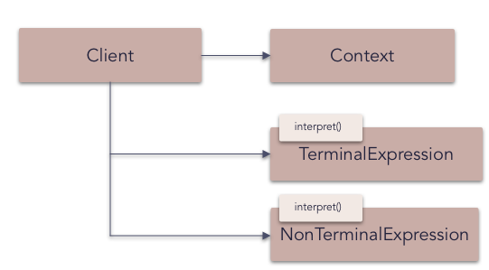

# Interpreter pattern

The **interpreter** pattern is a design pattern that specifies how to evaluate sentences in a language. The basic idea is to have a class for each symbol (terminal or nonterminal) in a specialized computer language. The syntax tree of a sentence in the language is an instance of the composite pattern and is used to evaluate (interpret) the sentence for a client.

_Frequency of use (in JavaScript):  low_

## Overview

**What problems can the Interpreter design pattern solve?**

- A grammar for a simple language should be defined
- so that sentences in the language can be interpreted.

When a problem occurs very often, it could be considered to represent it as a sentence in a simple language (Domain Specific Languages) so that an interpreter can solve the problem by interpreting the sentence.

For example, when many different or complex search expressions must be specified. Implementing (hard-wiring) them directly into a class is inflexible because it commits the class to particular expressions and makes it impossible to specify new expressions or change existing ones independently from (without having to change) the class.

**What solution does the Interpreter design pattern describe?**

- Define a grammar for a simple language by defining an `Expression` class hierarchy and implementing an `interpret()` operation.
- Represent a sentence in the language by an abstract syntax tree (AST) made up of `Expression` instances.
- Interpret a sentence by calling `interpret()` on the AST.

## Diagram

