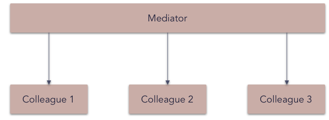

# Mediator pattern

The **mediator pattern** defines an object that encapsulates how a set of objects interact. This pattern is considered to be a behavioral pattern due to the way it can alter the program's running behavior.

Usually a program is made up of a large number of classes. Logic and computation are distributed among these classes. However, as more classes are added to a program, especially during maintenance and/or refactoring, the problem of communication between these classes may become more complex. This makes the program harder to read and maintain. Furthermore, it can become difficult to change the program, since any change may affect code in several other classes.

With the **mediator pattern**, communication between objects is encapsulated within a **mediator** object. Objects no longer communicate directly with each other, but instead communicate through the mediator. This reduces the dependencies between communicating objects, thereby reducing coupling.

_Frequency of use (in JavaScript):  medium low_

## Overview

**What problems can the Mediator design pattern solve?**

- Tight coupling between a set of interacting objects should be avoided.
- It should be possible to change the interaction between a set of objects independently.

Defining a set of interacting objects by accessing and updating each other directly is inflexible because it tightly couples the objects to each other and makes it impossible to change the interaction independently from (without having to change) the objects. And it stops the objects from being reusable and makes them hard to test.
Tightly coupled objects are hard to implement, change, test, and reuse because they refer to and know about many different objects.

**What solution does the Mediator design pattern describe?**

- Define a separate (mediator) object that encapsulates the interaction between a set of objects.
- Objects delegate their interaction to a mediator object instead of interacting with each other directly.

The objects interact with each other indirectly through a mediator object that controls and coordinates the interaction.
This makes the objects loosely coupled. They only refer to and know about their mediator object and have no explicit knowledge of each other.

## Diagram

