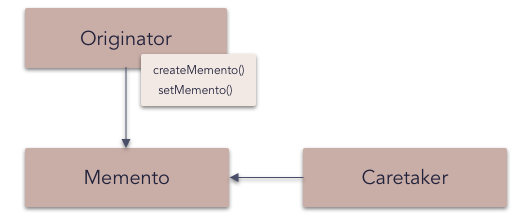

# Memento pattern

The **memento pattern** is a software design pattern that provides the ability to restore an object to its previous state (undo via rollback).

The memento pattern is implemented with three objects: the `originator`, a `caretaker` and a `memento`. The originator is some object that has an internal state. The caretaker is going to do something to the originator, but wants to be able to undo the change. The caretaker first asks the originator for a memento object. Then it does whatever operation (or sequence of operations) it was going to do. To roll back to the state before the operations, it returns the memento object to the originator. The memento object itself is an opaque object (one which the caretaker cannot, or should not, change). When using this pattern, care should be taken if the originator may change other objects or resources - the memento pattern operates on a single object.

_Frequency of use (in JavaScript):  low_

## Overview

**What problems can the Memento design pattern solve?**

- The internal state of an object should be saved externally so that the object can be restored to this state later.
- The object's encapsulation must not be violated.

The problem is that a well designed object is encapsulated so that its representation (data structure) is hidden inside the object and can't be accessed from outside the object.

**What solution does the Memento design pattern describe?**

Make an object (originator) itself responsible for

- saving its internal state to a (memento) object and
- restoring to a previous state from a (memento) object.

## Diagram

