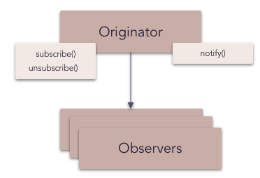

# Observer

The **observer pattern** is a software design pattern in which an object, called the subject, maintains a list of its dependents, called observers, and notifies them automatically of any state changes, usually by calling one of their methods.

It is mainly used to implement distributed event handling systems, in "event driven" software. Most modern languages such as C# have built in "event" constructs which implement the observer pattern components, for easy programming and short code.

The observer pattern is also a key part in the familiar model–view–controller (MVC) architectural pattern.

_Frequency of use (in JavaScript):  high_

## Overview

**What problems can the Observer design pattern solve?**

- A one-to-many dependency between objects should be defined without making the objects tightly coupled.
- It should be ensured that when one object changes state an open-ended number of dependent objects are updated automatically.
- It should be possible that one object can notify an open-ended number of other objects.

**What solution does the Observer design pattern describe?**

- Define `Subject` and `Observer` objects.
- so that when a subject changes state, all registered observers are notified and updated automatically.

## Diagram

