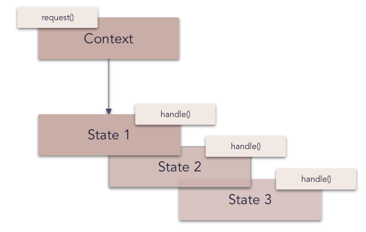

# State pattern

The **state pattern** is a behavioral software design pattern to allow an object to alter its behavior when its internal state changes. This pattern is close to the concept of Finite-state machine however it is important to keep in mind that this pattern is not a software implementation of Finite-state machine. The state pattern can be interpreted as a strategy pattern which is able to switch the current strategy through invocations of methods defined in the pattern's interface.

This pattern is used in computer programming to encapsulate varying behavior for the same object based on its internal state. This can be a cleaner way for an object to change its behavior at runtime without resorting to large monolithic conditional statements and thus improve maintainability.

_Frequency of use (in JavaScript):  medium low_

## Overview

**What problems can the State design pattern solve?**

- An object should change its behavior when its internal state changes.
- State-specific behavior should be defined independently. That is, new states should be added and the behavior of existing states should be changed independently.

Implementing state-specific behavior directly within a class is inflexible because it commits the class to a particular behavior and makes it impossible to add a new state or change the behavior of an existing state later independently from (without changing) the class.

**What solution does the State design pattern describe?**

- Define separate (state) objects that encapsulate state-specific behavior for each state. That is, define an interface (State) for performing state-specific behavior, and define classes that implement the interface for each state.
- A class delegates state-specific behavior to its current state object instead of implementing state-specific behavior directly.

This makes a class independent of how state-specific behavior is implemented. New states can be added by defining new state classes.
A class can change its behavior at run-time by changing its current state object.

## Diagram

