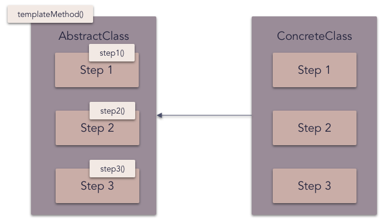

# Template method pattern

The **template method** pattern is a behavioral design pattern that defines the program skeleton of an algorithm in an operation, deferring some steps to subclasses. It lets one redefine certain steps of an algorithm without changing the algorithm's structure.

## Overview

This pattern has two main parts, and typically uses object-oriented programming:

The "template method", generally implemented as a base class (possibly an abstract class), which contains shared code and parts of the overall algorithm which are invariant. The template ensures that the overarching algorithm is always followed.[1] In this class, "variant" portions are given a default implementation, or none at all.
Concrete implementations of the abstract class, which fill in the empty or "variant" parts of the "template" with specific algorithms that vary from implementation to implementation.[3]
At run-time, a concrete class is instantiated. A main method inherited from the base class is called, which then may call other methods defined by both the base class and subclasses. This performs the overall algorithm in the same steps every time, but the details of some steps depend on which subclass was instantiated.

_Frequency of use (in JavaScript):  medium low_

## Diagram

