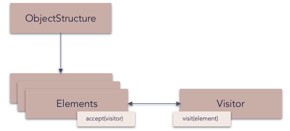

# Visitor pattern

The **visitor** design pattern is a way of separating an algorithm from an object structure on which it operates. A practical result of this separation is the ability to add new operations to existent object structures without modifying the structures. It is one way to follow the open/closed principle.

In essence, the visitor allows adding new virtual functions to a family of classes, without modifying the classes. Instead, a visitor class is created that implements all of the appropriate specializations of the virtual function. The visitor takes the instance reference as input, and implements the goal through double dispatch.

_Frequency of use (in JavaScript):  low_

## Overview

**What problems can the Visitor design pattern solve?**

- It should be possible to define a new operation for (some) classes of an object structure without changing the classes.

**What solution does the Visitor design pattern describe?**

- Define a separate (visitor) object that implements an operation to be performed on elements of an object structure.
- Clients traverse the object structure and call a dispatching operation accept(visitor) on an element — that "dispatches" (delegates) the request to the "accepted visitor object". The visitor object then performs the operation on the element ("visits the element").

## Diagram

