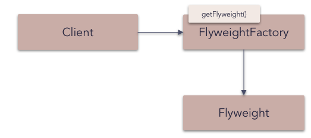

## Flyweight pattern

A **flyweight** is an object that minimizes memory usage by sharing as much data as possible with other similar objects; it is a way to use objects in large numbers when a simple repeated representation would use an unacceptable amount of memory. Often some parts of the object state can be shared, and it is common practice to hold them in external data structures and pass them to the objects temporarily when they are used.

A classic example usage of the flyweight pattern is the data structures for graphical representation of characters in a word processor. It might be desirable to have, for each character in a document, a glyph object containing its font outline, font metrics, and other formatting data, but this would amount to hundreds or thousands of bytes for each character. Instead, for every character there might be a reference to a flyweight glyph object shared by every instance of the same character in the document; only the position of each character (in the document and/or the page) would need to be stored internally.

_Frequency of use (in JavaScript):  high_

## Overview

**What problems can the Flyweight design pattern solve?**

- Large numbers of objects should be supported efficiently.
- Creating large numbers of objects should be avoided.

When representing large text documents, for example, creating an object for each character in the document would result in a huge number of objects that could not be processed efficiently.

**What solution does the Flyweight design pattern describe?**

Define `Flyweight` objects that

- store intrinsic (invariant) state that can be shared and
- provide an interface through which extrinsic (variant) state can be passed in.

This enables clients to reuse (share) `Flyweight` objects (instead of creating a new object each time) and pass in extrinsic state when they invoke a Flyweight operation.
This greatly reduces the number of physically created objects.

## Diagram

